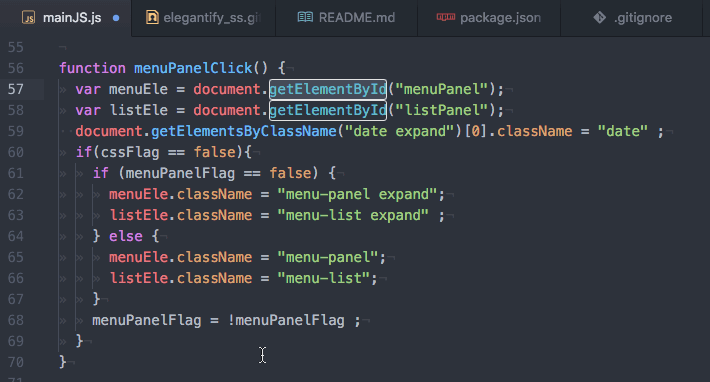

# jk-elegant

**Elegantify for ATOM**

Your code will be more elegant!  
\** This is a joke package, so I hope you have a very elegant mind :D

- - -

## shortcut

Mac : <kbd>control</kbd> + <kbd>option</kbd> + <kbd>e</kbd>  
Win : <kbd>Ctrl</kbd> + <kbd>Alt</kbd> + <kbd>e</kbd>

## screenshot

## caution!

Your code may be broken by this Elegantify.  
But, you never be afraid.  
This is a tiny problem for elegant.
